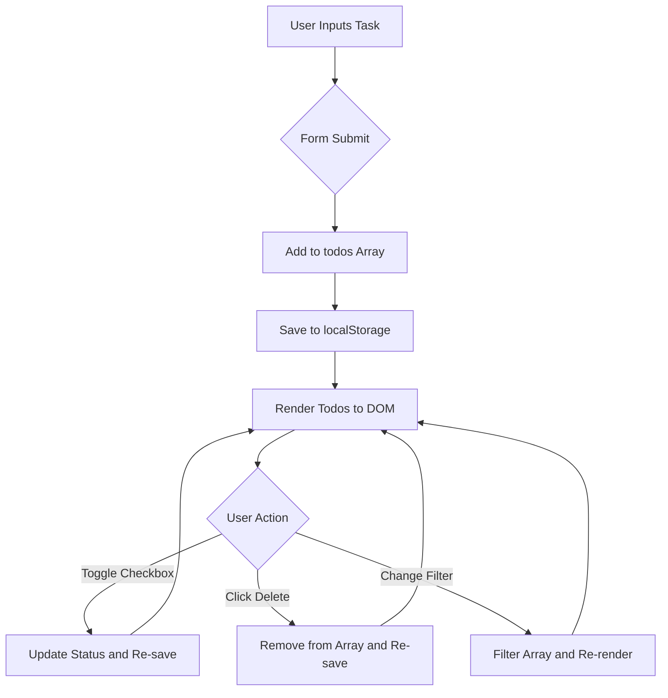

# To-Do List App

## 1. Table of Contents
- [About the Project](#2-about-the-project)
- [How It Works (Logic Flowchart)](#3-how-it-works-logic-flowchart)
- [Logic Breakdown](#logic-breakdown)
- [Result and Analysis](#4-result-and-analysis)
- [Technology Used](#5-technology-used)

---

# 2. About the Project

The **To-Do List App** is a modern and responsive task management application designed for efficient daily organization.

It provides:
- Real-time task filtering
- Persistent browser storage
- Clean and minimal UI
- Mobile responsiveness
- Dynamic task rendering

The app uses the browser's `localStorage` API to permanently save tasks even after page refreshes.

---

# 3. How It Works (Logic Flowchart)

The application synchronizes the user interface with a task array stored in browser memory.



---

# Logic Breakdown

## Data Persistence

The app uses:

```javascript
JSON.parse(localStorage.getItem("todos"))
```

to retrieve saved tasks when the application loads.

Whenever tasks are added, deleted, or updated, the app stores the latest data using:

```javascript
localStorage.setItem()
```

This ensures tasks remain available even after refreshing or reopening the browser.

---

## Filtering Mechanism

The `renderTodos()` function uses the `.filter()` method to generate filtered task views.

The available filters are:
- All Tasks
- Active Tasks
- Completed Tasks

Filtering is based on each task's `completed` boolean value.

---

## DOM Injection

The application dynamically creates task elements using:

```javascript
document.createElement("li")
```

Dynamic `innerHTML` rendering allows tasks to instantly appear in the UI without reloading the page.

---

## Unique Identification

Each task receives a unique ID generated using:

```javascript
Date.now()
```

This allows precise:
- Task deletion
- Status toggling
- Task updating

without affecting other tasks inside the array.

---

# 4. Result and Analysis

## Phase 1: Initial State and Empty State

When the application starts, it checks whether saved task data exists in `localStorage`.

If no tasks are available, the `emptyState` element becomes visible using:

```javascript
style.display = "block"
```

This provides users with a clear visual prompt encouraging them to add their first task.

---

## Phase 2: Adding and Managing Tasks

New tasks are inserted at the beginning of the array using:

```javascript
unshift()
```

This ensures the newest tasks appear first in the list.

During rendering:
- Event listeners are attached to checkboxes
- Delete buttons receive click handlers
- Real-time updates are reflected immediately

---

## Phase 3: Filtering and Status

The app correctly separates:
- Active Tasks
- Completed Tasks

Completed tasks receive a `.completed` CSS class that applies:

```css
text-decoration: line-through;
color: gray;
```

This improves readability and visually distinguishes completed work from pending tasks.

---

## Phase 4: Mobile Responsiveness

The layout is optimized for smaller screens using:

```css
@media (max-width: 600px)
```

On mobile devices:
- The form layout changes from row to column
- Input fields expand to full width
- Buttons become larger and easier to tap

This significantly improves the mobile user experience.

---

# 5. Technology Used

| Technology | Role |
|---|---|
| HTML5 | Semantic structure for forms, filters, and task containers |
| CSS3 | Styling, Flexbox layouts, transitions, and responsive design |
| JavaScript (ES6) | Core logic handling arrays, DOM updates, and localStorage |
| Gemma 3 Flash | Logic optimization and code structure consultation |
| Gemini | UI/UX layout analysis and responsiveness refinement |
| Claude | Filter logic and state management debugging |
| Grok | Storage logic and error handling validation |

---

# Final Output

The final application successfully delivers:
- Real-time task management
- Persistent local storage
- Dynamic filtering
- Responsive mobile layout
- Clean and interactive user experience

The project demonstrates practical implementation of:
- DOM manipulation
- Array operations
- Event handling
- Browser storage APIs
- Responsive frontend development
